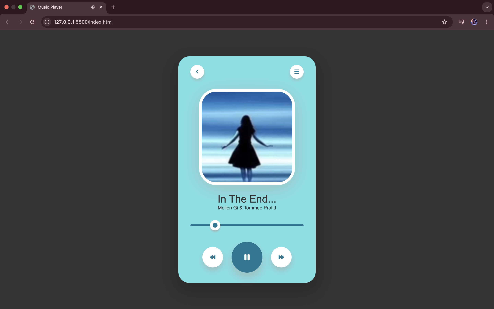

# Music Player

A lightweight and responsive web-based music player built using HTML, CSS, and JavaScript. This project demonstrates the basic functionality of audio playback in the browser with a clean UI.

## Technologies Used

  - HTML5 – For page structure
  - CSS – For styling and layout
  - JavaScript – For interactivity and playback logic

## Setup Instructions

1. Clone the repository:
   git clone https://github.com/s-e-j-a-l/Music-Player.git
2. run the index.html file.

